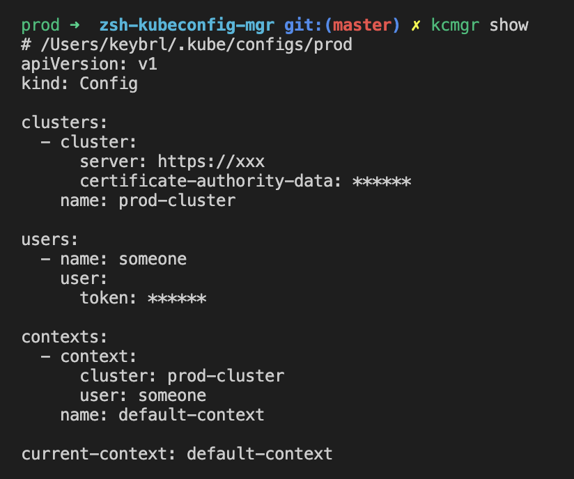
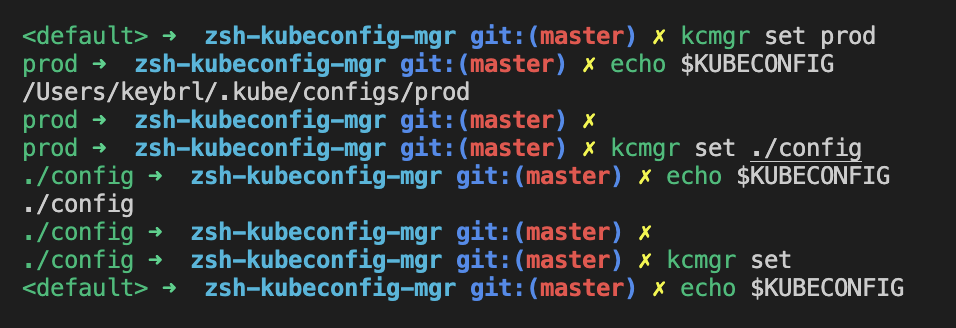
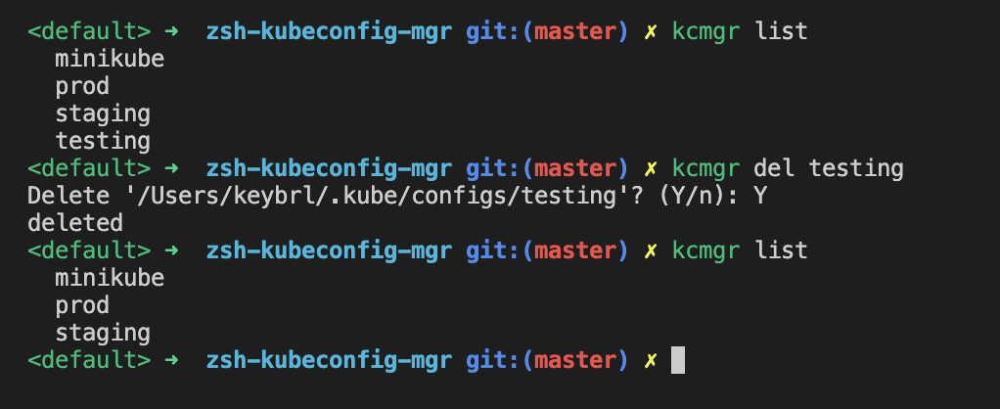

# zsh-kubeconfig-mgr

> 该项目是一个 [Zsh](https://www.zsh.org/) 和 [oh-my-zsh](https://ohmyz.sh/) 的插件，旨在更便捷地管理和使用多个 kubeconfig 文件。

某些情况下，可能需要操作多个不同的 [Kubernetes](https://kubernetes.io/) 集群，每个集群有不一样的凭证。可能因为各种原因，将它们合并到一个 kubeconfig 文件中并不方便。因此在操作不同的集群时需要经常性地将变量 `$KUBECONFIG` 设置为不同的值，或者在执行 `kubectl` 使用参数 `--kubeconfig /path/to/config ...` 指定不同的 kubeconfig 文件，这些操作都十分繁琐且容易出错。

该项目将提供解决这些问题的一个思路。

## 安装

### 1 安装插件

**Oh-my-zsh:**

需要先安装 [oh-my-zsh](https://ohmyz.sh/) ，然后：

1. 克隆项目源码到 oh-my-zsh 的插件目录
   ```sh
   git clone https://github.com/keybrl/zsh-kubeconfig-mgr.git ${ZSH_CUSTOM:-~/.oh-my-zsh/custom}/plugins/zsh-kubeconfig-mgr
   ```
2. 在 `~/.zshrc` 中配置启用该插件
   ```zsh
   plugins=( [plugins...] zsh-kubeconfig-mgr)
   ```
3. 重启 zsh （比如重新开启一个终端）

**Zsh:**

如果没有安装 oh-my-zsh ，直接克隆项目源码并执行 `source` 即可：

```sh
git clone https://github.com/keybrl/zsh-kubeconfig-mgr.git
source ./zsh-kubeconfig-mgr/zsh-kubeconfig-mgr.zsh
echo "source ${(q-)PWD}/zsh-kubeconfig-mgr/zsh-kubeconfig-mgr.zsh" >> ${ZDOTDIR:-$HOME}/.zshrc
```

### 2 设置命令行提示

该插件提供了命令行提示，可根据需要添加到变量 `PROMPT` 或 `RPROMPT` 中

例如在 `~/.zshrc` 末尾添加：

```zsh
PROMPT='$(kubeconfig_prompt_info) '$PROMPT
```

## 使用

### 命令行提示

函数 `kubeconfig_prompt_info` 会打印当前 `$KUBECONFIG` 变量指定的 kubeconfig 。其值有如下几种情形：

- `<default>` 表示 `$KUBECONFIG` 值为空，此时生效的 kubeconfig 为 `~/.kube/config`
- `config` 表示 `~/.kube/configs/config`
- `./path/to/config` 表示 kubeconfig 的相对路径
- `~/path/to/config` 表示 kubeconfig 的相对于 `$HOME` 的路径
- `/path/to/config` 表示 kubeconfig 的绝对路径

打印的颜色表示对应 kubeconfig 是否存在：

- 绿色：存在
- 红色：不存在或不是个文件

可根据需要添加到变量 `PROMPT` 或 `RPROMPT` 中

例如在 `~/.zshrc` 末尾添加：

```zsh
PROMPT='$(kubeconfig_prompt_info) '$PROMPT
```

效果：


### 列出 kubeconfig

`kcmgr ls` ， `kcmgr list` 或 `lkc` (**l**ist **k**ube**c**onfig)

列出 `~/.kube/configs/` 目录下的所有文件


### 展示 kubeconfig 内容

`kcmgr show [config]` 或 `rkc [config]` (**r**ead **k**ube**c**onfig)

- `kcmgr show` 展示当前生效的 kubeconfig 内容
- `kcmgr show <config>` 展示指定 kubeconfig 内容



### 切换 kubeconfig

`kcmgr set [config]` 或 `skc [config]` (**s**et **k**ube**c**onfig)

- `kcmgr set` 等同于 `unset KUBECONFIG`
- `kcmgr set <config>` 设置 `$KUBECONFIG` 指向指定 kubeconfig



### 删除 kubeconfig

`kcmgr delete [config]` ， `kcmgr del [config]` 或 `dkc [config]` (**d**elete **k**ube**c**onfig)

- `kcmgr delete` 删除当前生效的 kubeconfig
- `kcmgr delete <config>` 删除指定 kubeconfig



### 编辑 / 新增 kubeconfig

`kcmgr edit [config]` 或 `ekc [config]` (**e**dit **k**ube**c**onfig)

- `kcmgr edit` 编辑当前生效的 kubeconfig
- `kcmgr edit <config>` 编辑指定 kubeconfig

编辑时优先使用 `vim` ，如果 `vim` 不存在则使用 `vi` 。如果 kubeconfig 不存在会被自动创建。


